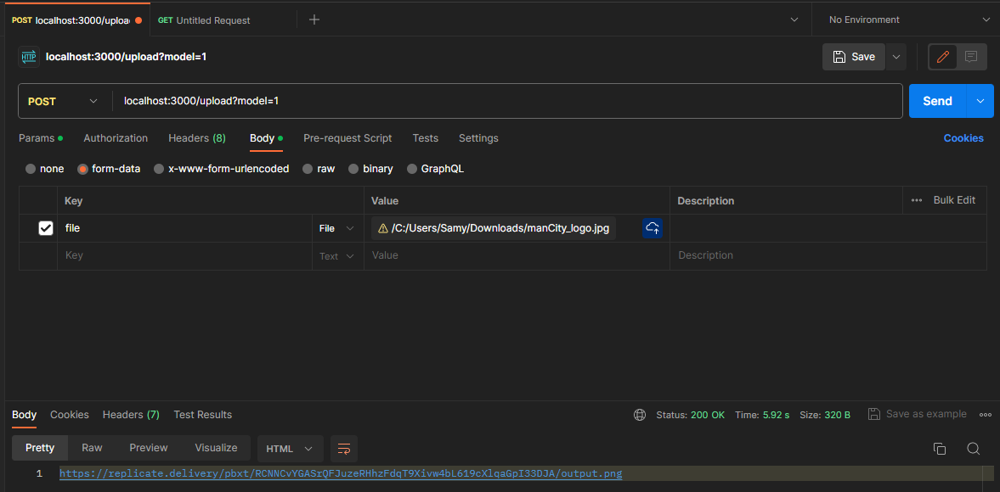

# Vizualize.AI

1. [Documentation](#documentation)

2. [Thought process](#thought-process)

## Documentation

this project has only one endpoint which is `/upload`. In order to run the project follow these steps:

```text
1- clone repo
2- cd Vizualize.AI
3- npm i
4- npm start
```

then open postman you can download it from [here](https://www.postman.com/downloads/) and then follow these steps:

```text
1- open post man and press  ctrl + n and choose HTTP
2- choose POST from drop down menu and add this url:
                localhost:3000/upload?model=1
3- choose Body and choose from-data
4- in the key-value pair add the following:
   a. in key colum type file and choose file
   b. in value colum upload an image
5- click send and you should get the response in seconds.
```
it should lookm like this:


`Note:`<br/>
In the url there is a query param `model` which can be equal to either `1` or `2` which reflect the model that is being used in the request. Model `1` refer to Real-ESRGAN with optional face correction and adjustable upscale. While model `2` refer to Create a 3D photo from single in-the-wild 2D images and it take long time to create the output.

## Thought process

During the implementation of this task i was keen to follow the modularity structure in addition to simplicity in the code.on the other hand i have face some difficulty one of them is the image size and how i will pass it to the model. I solve it by compress it then convert it to buffer array in order to pass it to the model. Other than that it was all about framework of testing and how to properly configure it with the current stack.
 